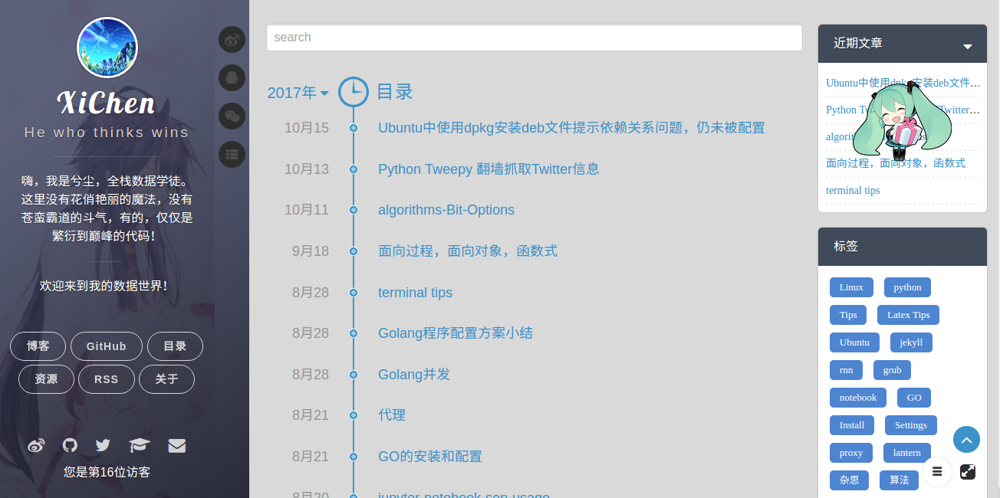
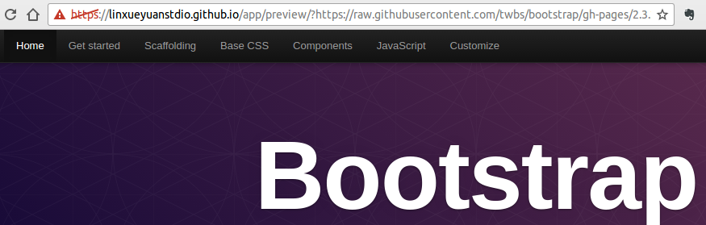

# :green_heart::blue_heart::purple_heart::sparkling_heart:XiChen's Blog:sparkling_heart::purple_heart::blue_heart::green_heart:

[](https://linxueyuanstdio.github.io/)
[](https://github.com/LinXueyuanStdio/LinXueyuanStdio.github.io/archive/master.zip)
[](145)
[](Apache-2.0)
[](https://github.com/LinXueyuanStdio/LinXueyuanStdio.github.io)
[](https://github.com/LinXueyuanStdio/LinXueyuanStdio.github.io/fork)
[]()

Blog for recording learning process.




# :green_heart:Browser Support:green_heart:

|  |  |  |  |  |
|:---:|:---:|:---:|:---:|:---:|
| 42+ ✔ | 40+ ✔ | 8+ ✔ | 29+ ✔ |  8+ ✔ |

# :sparkles:Installation:sparkles:

```shell
sudo apt install ruby-full ruby-bundler
sudo gem install jekyll
bundle exec jekyll serve
```

# :notebook_with_decorative_cover:To Do List

- :white_medium_square:timeline:`https://meta.appinn.com/t/markdown/3054`
- :white_check_mark:目录显示问题
- :white_check_mark:overflow:auto滑块定制
- :white_check_mark:generate girls app (bugs)
- :white_medium_square:add html+js+css pratical apps
- :white_medium_square:phone side adjustice
- :white_medium_square:tags page fix tag size bug

# :books:History:books:
- :white_check_mark:`2017-11-03`:add app `preview` : render html from `other repos` in `this site`



- :white_check_mark:`2017-10-27`:enable app in [https://linxueyuanstdio.github.io/app/generate-girls/#/](https://linxueyuanstdio.github.io/app/generate-girls/#/) as mirror of [make.girls.moe](http://make.girls.moe)
- :white_check_mark:`2017-08-31`:miku生日，加一个美美哒小挂件

  

<!-- Whitespace added for readability -->
```js
{% assign m = page.date | date: "%-m" %}
{{ page.date | date: "%-d" }}

  Januar
  Februar
  March
  April
  Mai
  Juni
  Juli
  August
  September
  Oktober
  November
  Dezember

{{ page.date | date: "%Y" }}
```
:/play trombone:
